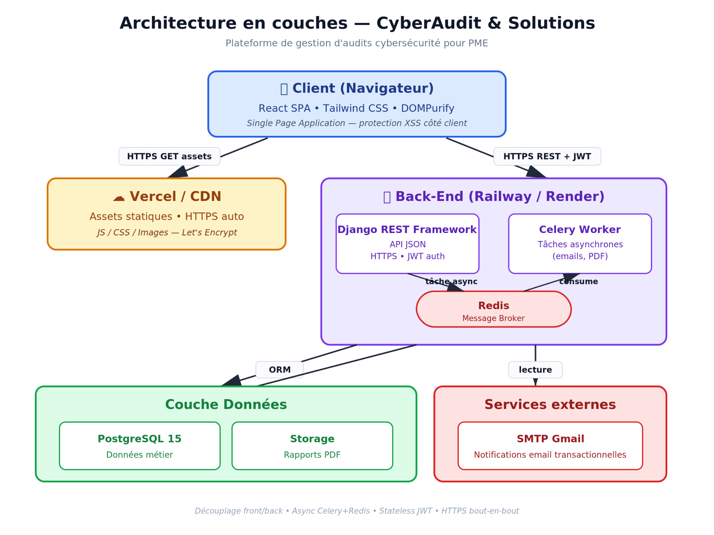
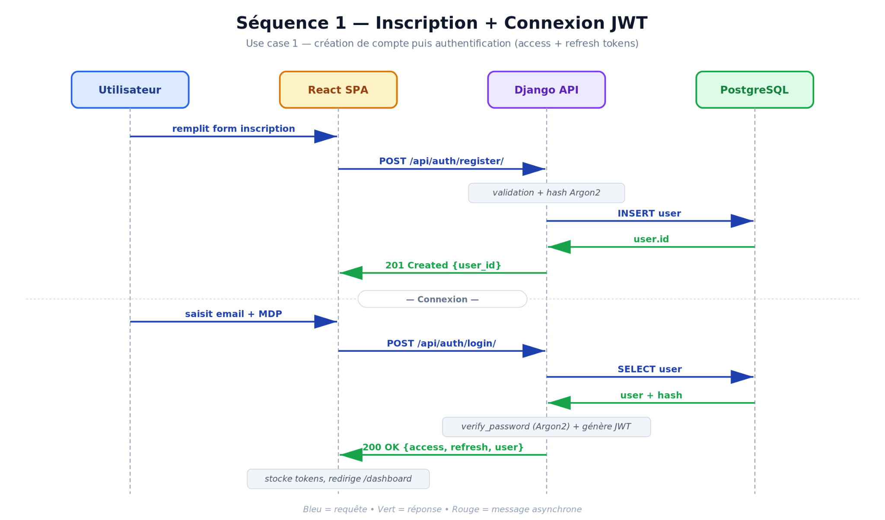
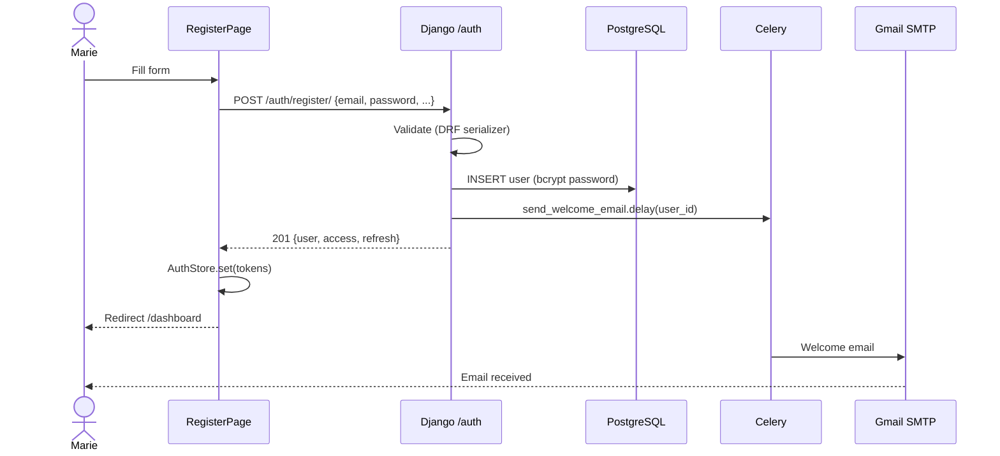
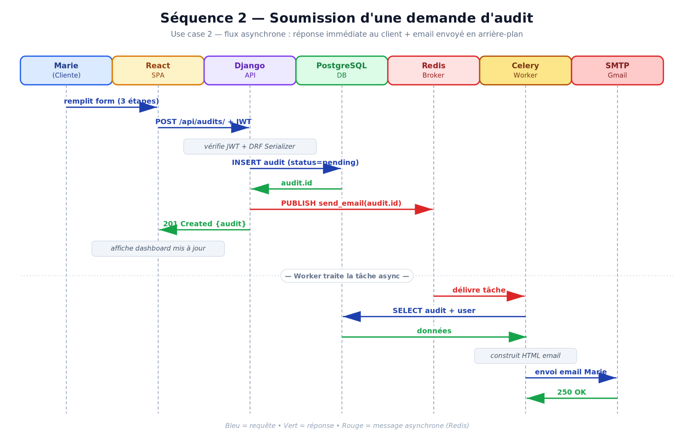
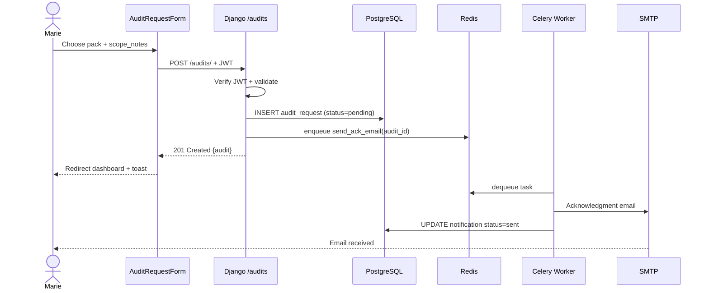
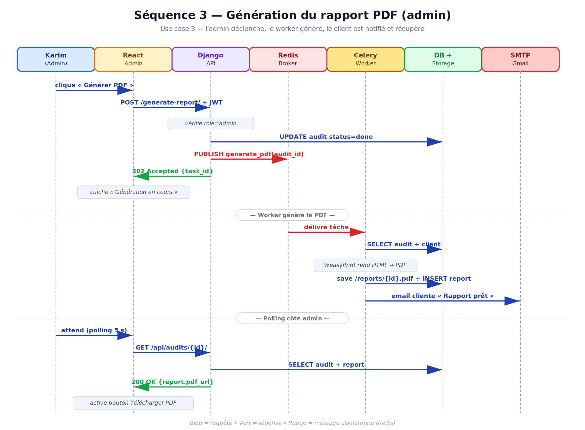
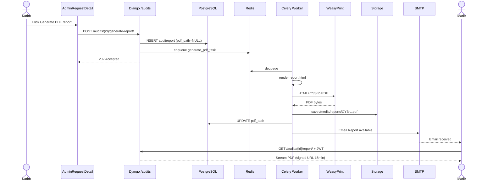

# CyberAudit & Solutions — Technical Documentation

> **Stage 3 — Technical documentation of the MVP**
> Reusable for **RNCP 5 — Web and Mobile Web Developer**
> Holberton School Dijon — Class of 2026

| Project Role | Member | Technical Role |
|---|---|---|
| Technical Lead | **Tommy JOUHANS** | Front-End Developer |
| Technical Lead | **James ROUSSEL** | Back-End Developer |

---

## Table of Contents

- [1. Introduction](#1-introduction)
  - [1.1 Context](#11-context)
  - [1.2 Document Scope](#12-document-scope)
  - [1.3 Target Audience](#13-target-audience)
  - [1.4 Technical Stack](#14-technical-stack)
- [2. User Stories & Mockups](#2-user-stories--mockups)
  - [2.1 Personas](#21-personas)
  - [2.2 Prioritized User Stories (MoSCoW)](#22-prioritized-user-stories-moscow)
  - [2.3 Screen Descriptions (11 mockups)](#23-screen-descriptions-11-mockups)
- [3. System Architecture](#3-system-architecture)
  - [3.1 Overview — Layered Architecture](#31-overview--layered-architecture)
  - [3.2 Data Flow — Audit Request](#32-data-flow--audit-request)
  - [3.3 Architecture Choices Justified](#33-architecture-choices-justified)
  - [3.4 Accessibility (WCAG 2.1 AA)](#34-accessibility-wcag-21-aa)
  - [3.5 Performance Budget (Web Vitals)](#35-performance-budget-web-vitals)
- [4. Components, Classes and Database](#4-components-classes-and-database)
  - [4.1 Database Schema](#41-database-schema)
  - [4.2 Back-End Class Diagram](#42-back-end-class-diagram)
  - [4.3 Front-End Components (React + Tailwind)](#43-front-end-components-react--tailwind)
  - [4.4 PDF Report Generation](#44-pdf-report-generation)
  - [4.5 Monitoring & Observability](#45-monitoring--observability)
  - [4.6 Database Migrations & Seeding](#46-database-migrations--seeding)
- [5. Sequence Diagrams](#5-sequence-diagrams)
  - [5.1 Sign-up + JWT Login](#51-sign-up--jwt-login)
  - [5.2 Audit Request Submission (async)](#52-audit-request-submission-async)
  - [5.3 PDF Report Generation (admin)](#53-pdf-report-generation-admin)
- [6. API Documentation](#6-api-documentation)
  - [6.1 External APIs Consumed](#61-external-apis-consumed)
  - [6.2 Internal API — REST Endpoints](#62-internal-api--rest-endpoints)
  - [6.3 Cross-Cutting Conventions](#63-cross-cutting-conventions)
- [7. SCM & QA Strategy](#7-scm--qa-strategy)
  - [7.1 Source Code Management (Git)](#71-source-code-management-git)
  - [7.2 QA Strategy](#72-qa-strategy)
  - [7.3 Manual Security Tests](#73-manual-security-tests)
  - [7.4 CI/CD Pipeline](#74-cicd-pipeline)
  - [7.5 GDPR Compliance](#75-gdpr-compliance)
- [8. Appendices](#8-appendices)
  - [8.1 Glossary](#81-glossary)
  - [8.2 Stage 3 ↔ RNCP 5 Skills Mapping](#82-stage-3--rncp-5-skills-mapping)
  - [8.3 Sources & Technical References](#83-sources--technical-references)
  - [8.4 Project Risk Matrix](#84-project-risk-matrix)
  - [8.5 Internal Project Links](#85-internal-project-links)

---

## 1. Introduction

### 1.1 Context

CyberAudit & Solutions is a full-stack web platform that connects French SMEs/VSEs without an in-house IT team to cybersecurity experts. According to the French ANSSI 2023 report, 45% of SMEs have no dedicated IT team and remain exposed to cyberattacks (ransomware, phishing, data leaks).

### 1.2 Document Scope

This technical documentation covers the detailed design of the MVP. It describes:

- User needs formalized as prioritized User Stories
- Software architecture and data flow
- Data model (relational PostgreSQL)
- Back-end classes, front-end components, interaction scenarios
- Consumed and exposed APIs
- Code management and quality strategy

### 1.3 Target Audience

- **Development team** (Tommy + James) — reference during the coding phase (W2 → W12)
- **Holberton jury** — proof of the detailed MVP design
- **RNCP 5 jury** — skills portfolio reusable for the Web and Mobile Web Developer certification

### 1.4 Technical Stack

| Layer | Technology | Justification |
|---|---|---|
| Front-End | React 18 + Tailwind CSS | Performant SPA, rapid design system |
| Back-End | Django 5 + DRF | Native security, mature ecosystem |
| Database | PostgreSQL 15 | Relational ACID, performant indexes |
| Async | Celery + Redis | Long-running tasks off the HTTP thread |
| Auth | SimpleJWT | Stateless, scalable |
| Hosting | Vercel + Railway | Auto HTTPS, Git deploy |

---

## 2. User Stories & Mockups

### 2.1 Personas

- **Marie** — 45, manages an accounting firm in Dijon, no IT skills. UX target < 3 min.
- **Karim** — 32, cybersecurity expert, handles the audit request queue in parallel.

### 2.2 Prioritized User Stories (MoSCoW)

#### Must Have

| ID | User Story | Stage |
|---|---|---|
| US-01 | As a visitor, I want to register so I can create my account. | W3 |
| US-02 | As a user, I want to log in so I can access my space. | W3 |
| US-03 | As a user, I want to log out so I can protect my account. | W3 |
| US-04 | As an SME client, I want to submit a request in < 3 min. | W4 |
| US-05 | As a client, I want to track the status (4 statuses). | W4 |
| US-06 | As a client, I want to receive an email on each change. | W4 |
| US-07 | As an admin, I want to view all sorted requests. | W5 |
| US-08 | As an admin, I want to change the status. | W5 |
| US-09 | As an admin, I want to generate a PDF. | W5 |
| US-10 | As a client, I want to download my PDF. | W5 |

#### Should Have

US-11 awareness modules • US-12 password reset • US-13 admin filters • US-14 UI notifications.

#### Could Have / Won't Have

US-15 to US-17 (V2). Out of scope: mobile app, AI score, marketplace, OAuth2, gamification.

### 2.3 Screen Descriptions (11 mockups)

#### Screen 1 — Public Landing

Hero (ANSSI problem), CTA, benefits. The landing page presents the company, services and packs tailored to entrepreneurs with fewer than 50 employees. The user clicks **SIGN IN** to create an account and log in.


#### Screen 2 — Sign-up

Email + Password + GDPR/T&C consent. After clicking **Create an account**, Marie enters her company name, first name, last name, email and password (hashed). Validation rules:

- Each field is max 50 characters
- Missing field → "please complete the form"
- Email format `name@domain` required
- Password: one lowercase, one uppercase, one digit, one special char, min 10 chars


#### Screen 3 — Login

Email + Password. The client logs in with her account; otherwise she clicks **Create an account**. "Lost Mail" and "Lost Password" links planned (future enhancement for the RNCP 5 portfolio).


#### Screen 4 — Client Dashboard

Sidebar, request list, floating CTA. Once logged in, the client tracks her audit request progress (Pending / In progress / Completed). She clicks **View details** and can download the report via **Download report**.


#### Screen 5 — Audit Request Form

3-step stepper, target < 3 min. The client fills in username, company name, pack choice (Audit / Security / Protection / Premium) with display of **Included Services**, and an optional message. She clicks **Send the Audit Request**.

.png)

#### Screen 6 — Request Detail (client)

Status, timeline. After submission, a confirmation message is sent to the expert (Karim) and an acknowledgment to the client. The client tracks the analysis progress.

.png)

#### Screen 7 — Training Modules

Card list + Markdown detail (future enhancement). Modules: "anti-phishing", "Multi-factor authentication", "Public Wi-Fi & VPN", "Data backup", "Incident response". Various formats (video, video call, documentation) with progress bar.


#### Screen 8 — Admin Dashboard

Table + filters. The expert (Karim) accesses his dashboard with all requests. He can sort by pack, by current status, then view and edit each request.

.png)

#### Screen 9 — Request Detail (admin)

Status selector + generator button. By clicking **View/edit**, Karim changes the status via the **Status & Actions** form, generates a PDF report via **Generate PDF report**, sends a notification (**Send notification**), and can archive the request (**Archive request**).

.png)

#### Screen 10 — PDF Report Viewer

The report can be downloaded. It identifies:

- Vulnerability level (Low, Medium, High)
- Assets (mail server, Wi-Fi router, etc.)
- Description
- Recommendations

A 30-day action plan is generated.


#### Screen 11 — Download from Dashboard

The client downloads the report from her dashboard via the **Download report** link.

.png)

---

## 3. System Architecture

### 3.1 Overview — Layered Architecture

The architecture follows a layered model: Client (browser) → CDN/Backend → Data + External services.

- **Client (Browser)** — React SPA · Tailwind CSS · DOMPurify (anti-XSS), HTTPS, REST + JWT
- **Vercel / CDN** — Static assets · HTTPS Let's Encrypt
- **Back-End (Railway / Render)** — Django REST API (JSON, JWT, HTTPS) — Celery Worker (async) — Redis (broker) — ORM — SMTP
- **Data Layer** — PostgreSQL 15 + PDF storage
- **External Services** — SMTP Gmail (email notifications)



### 3.2 Data Flow — Audit Request

1. Marie fills in the form in the React SPA.
2. The front-end sends `POST /api/audits/` (JSON + JWT in `Authorization: Bearer`).
3. Django validates the request (DRF serializer) and persists it via the ORM.
4. Django enqueues a Celery task `send_acknowledgment_email(audit_id)` in Redis.
5. Django responds `201 Created` with the audit details.
6. Karim (admin) sees the new request in his dashboard (30 s polling — V2: WebSocket).

### 3.3 Architecture Choices Justified

- **Front/back decoupling** → 2 independent deployments, controlled CORS, SPA cacheable on CDN.
- **Async with Celery** → PDF generation can take 5–10 s; we don't block the HTTP thread.
- **Relational PostgreSQL** → strongly structured data with relations (User → AuditRequest → Report), critical ACID integrity.
- **Stateless JWT** → no server session, horizontally scalable.

### 3.4 Accessibility (WCAG 2.1 AA)

The primary user (Marie, 45, non-technical) requires an accessible journey. The platform targets **WCAG 2.1 level AA** compliance across the 4 principles: perceivable, operable, understandable, robust.

#### Rules Applied

| WCAG Principle | Implementation |
|---|---|
| Minimum contrast | 4.5:1 on body text, 3:1 on large text. `cyber-700` (#5b21b6) on white validated — checked with `axe DevTools`. |
| Keyboard navigation | All interactive elements reachable via `Tab` / `Shift+Tab`. Logical focus order. `:focus-visible` Tailwind 2px purple ring on every CTA. |
| ARIA labels | `StatusBadge` exposes `aria-label="Status: in progress"`. `SecurityScoreGauge` exposes `role="meter"` + `aria-valuenow`. Decorative icons `aria-hidden="true"`. |
| Forms | Every `<input>` has an associated `<label>` (not just a placeholder). Error messages tied via `aria-describedby`. Required fields announced with `aria-required`. |
| Semantic structure | `<header>`, `<nav>`, `<main>`, `<footer>` tags, heading hierarchy `h1`→`h6` without skipping. "Skip to content" link first. |
| Images and icons | Systematic `alt` attribute: descriptive if informative, empty if decorative. Architecture diagrams offered as accessible SVG + text equivalent. |
| Multilingual | `lang="fr"` on `<html>`. No content mixing FR/EN without `lang` switch. |
| Animations | `prefers-reduced-motion` respected via Tailwind media query: transitions disabled if the user requests so in their OS. |

#### Automated Accessibility Testing

- **axe-core** integrated into Vitest tests: `npm install -D @axe-core/react jest-axe`. Each major component (LoginForm, AuditRequestForm, RequestTable) tested via `expect(await axe(container)).toHaveNoViolations()`.
- **Lighthouse CI** in the GitHub Actions pipeline: Accessibility score ≥ 90 required to merge.
- **Manual testing W7-W10**: 100% keyboard navigation on the 3 critical journeys (sign-up, audit submission, PDF download), screen reader testing with NVDA (Windows) and VoiceOver (macOS).

#### Measurable Target

Lighthouse Accessibility score **≥ 90/100** on the 4 main pages (landing, login, client dashboard, audit form) before the W12 defense.

### 3.5 Performance Budget (Web Vitals)

The target UX (Marie, < 3-min journey) imposes a non-negotiable performance requirement. The platform sets a **performance budget** aligned with Google's *Core Web Vitals*.

#### Web Vitals Targets

| Metric | "Good" Target | Definition & Impact |
|---|---|---|
| **LCP** (Largest Contentful Paint) | < 2.5 s | Time to render the largest visible element. Measures perceived load. |
| **INP** (Interaction to Next Paint) | < 200 ms | Response latency to user interactions (replaces FID since March 2024). |
| **CLS** (Cumulative Layout Shift) | < 0.1 | Visual stability — no unexpected layout jumps. |
| **TTI** (Time to Interactive) | < 3.5 s | Time before user can click/type without lag. |
| **TTFB** (Time to First Byte) | < 600 ms | Server delay — covers Django + DB. |
| **JS bundle** | < 200 kB gzipped | Initial JavaScript weight. Beyond, 3G/4G degradation. |
| **Lighthouse Perf** | ≥ 85/100 | Aggregated global score, computed in CI on every PR. |

#### Optimization Strategies

- **Code splitting** via `React.lazy()` and `Suspense` on each route (LoginPage, ClientDashboard, AdminDashboard, TrainingPage) → lighter initial load.
- **Tree-shaking** automatic via Vite, named imports only (no `import * as ...`).
- **Images**: `` by default, AVIF/WebP via `vite-plugin-imagemin`, explicit dimensions (anti-CLS).
- **Web fonts**: `font-display: swap`, preload main font via `<link rel="preload">`.
- **HTTP cache**: Vercel static assets with `Cache-Control: public, max-age=31536000, immutable` (hash-based cache busting).
- **API**: pagination 20 items default, never `SELECT *` in Django (`only()` / `defer()` on lists).
- **DB**: BTREE and composite indexes (see §4.1), `select_related` / `prefetch_related` systematic to avoid N+1.

#### Measurement and CI

- **Lighthouse CI** in GitHub Actions: runs on every PR over the 4 key pages, fails if Performance < 85 or Web Vitals exceed targets.
- **Sentry Performance**: p50/p75/p95 tracking of LCP and INP in production (10% sample rate).
- **Bundle analyzer**: `rollup-plugin-visualizer` on every release, alert if bundle exceeds 200 kB.
- **Real User Monitoring** (V2): `web-vitals.js` sends real metrics to a `/api/metrics/vitals/` endpoint.

---

## 4. Components, Classes and Database

### 4.1 Database Schema

| Entity | Key Fields | Relations |
|---|---|---|
| `USER` | id (UUID), email (UK), password_hash, first_name, last_name, role (client/admin), company_name, created_at, is_active | 1→N AuditRequest (submits / follows / receives) |
| `AUDIT_PACK` | id, reference, code (audit/security/protection/premium), name, description, duration_days, price | 1→N AuditRequest (chosen_by) |
| `AUDIT_REQUEST` | id (UUID), client_id (FK), pack_id (FK), status (pending/in_progress/done/archived), scope_notes, submitted_at, updated_at, completed_at | N→1 User+Pack ; 1→1 Report ; 1→N Notification |
| `AUDIT_REPORT` | id (UUID), audit_request_id (FK UK), pdf_path, summary, findings (JSON), generated_at | 1→1 AuditRequest |
| `TRAINING_MODULE` | id, title, content_md, duration_min, level, published_at | 1→N Progress |
| `TRAINING_PROGRESS` | id, user_id, module_id, completed, started_at, completed_at | N→1 User + Module |
| `NOTIFICATION` | id, user_id, request_id, type, subject, status, sent_at | N→1 User + Request |

**Recommended indexes:**

- `USER.email` UNIQUE
- `AUDIT_REQUEST.status` BTREE (frequent admin filtering)
- (`AUDIT_REQUEST.client_id`, `AUDIT_REQUEST.created_at`) composite (client dashboard)
- `AUDIT_REPORT.audit_request_id` UNIQUE (1 report per request)


### 4.2 Back-End Class Diagram

#### Class `User`

Represents a platform user, SME client or CyberAudit admin. Handles JWT authentication and role separation.

| Attribute | Description |
|---|---|
| `id : UUID` | Unique identifier (PK) |
| `email : str` | Email address (unique, indexed) |
| `_password_hash : str` | Hashed password (PBKDF2) |
| `first_name, last_name` | First and last name |
| `role : enum` | client or admin |
| `company_name : str` | Company name (nullable) |
| `is_active : bool` | Account enabled/disabled |
| `created_at : datetime` | Account creation date |

**Methods:** `check_password(raw)`, `has_role(role)`

#### Class `AuditPack`

Represents one of the 4 packs (Audit, Security, Protection, Premium). Reference data loaded via fixture.

| Attribute | Description |
|---|---|
| `id : int` | Unique identifier |
| `code : enum` | audit / security / protection / premium |
| `name : str` | Commercial name |
| `description : str` | List of included services |
| `duration_days : int` | Estimated processing time |
| `price : Decimal` | Pack price |

#### Class `AuditRequest`

Core of the business: the audit request submitted by an SME client. 4-status cycle (pending → in_progress → completed → archived).

| Attribute | Description |
|---|---|
| `id : UUID` | Unique identifier |
| `reference : str` | Readable case number (e.g., CYB-2026-0042) |
| `client_id : FK → User` | Submitting client |
| `pack_id : FK → AuditPack` | Chosen pack |
| `status : enum` | pending / in_progress / completed / archived |
| `scope_notes : str` | Notes from the form |
| `submitted_at, completed_at` | Lifecycle dates |

**Methods:** `generate_reference()`, `update_status(new_status)`, `estimated_completion()`

#### Class `AuditReport`

Vulnerability report tied to a single AuditRequest, includes a visual score and a downloadable PDF.

| Attribute | Description |
|---|---|
| `id : UUID` | Unique identifier |
| `audit_request_id : FK` | 1-1 relation |
| `summary : str` | Plain-language executive summary |
| `security_score : int` | Score 0-100 (gauge) |
| `findings : JSON` | List of vulnerabilities |
| `pdf_path : str` | Generated PDF path |
| `generated_at` | Generation date |

**Methods:** `build_pdf()`, `get_download_url()`

#### Class `Notification`

Tracks all emails sent via Celery.

| Attribute | Description |
|---|---|
| `id : UUID` | Unique identifier |
| `user_id : FK → User` | Recipient |
| `request_id : FK` | Related request (nullable) |
| `type : enum` | request_received / status_changed / report_ready |
| `status : enum` | queued / sent / failed |

**Methods:** `send()`, `retry()`

#### Classes `TrainingModule` & `TrainingProgress`

Cybersecurity awareness modules (phishing, MFA, GDPR…) with per-user progress tracking.


#### Example — `accounts/models.py`

```python
class User(AbstractBaseUser, PermissionsMixin):
    """Platform user — SME client or CyberAudit admin."""
    id           = UUIDField(primary_key=True, default=uuid4)
    email        = EmailField(unique=True, db_index=True)
    role         = CharField(choices=[('client','Client'),('admin','Admin')])
    company_name = CharField(max_length=200, blank=True)
    company_size = CharField(choices=[('TPE','TPE'),('PME','PME'),('ETI','ETI')])
    sector       = CharField(max_length=100, blank=True)
    is_active    = BooleanField(default=True)
    created_at   = DateTimeField(auto_now_add=True)
    last_login   = DateTimeField(null=True)

    USERNAME_FIELD = 'email'
    REQUIRED_FIELDS = []

    def is_admin(self) -> bool: ...
    def is_client(self) -> bool: ...
```

#### Example — `audits/models.py`

```python
class AuditPack(models.Model):
    """Catalog of the 4 audit packs."""
    name          = CharField(max_length=50)
    description   = TextField()
    duration_days = PositiveIntegerField()
    price         = DecimalField(max_digits=8, decimal_places=2)


class AuditRequest(models.Model):
    """Audit request submitted by a client."""
    STATUS_CHOICES = [
        ('pending', 'Pending'),
        ('in_progress', 'In progress'),
        ('done', 'Done'),
        ('archived', 'Archived'),
    ]
    id           = UUIDField(primary_key=True, default=uuid4)
    client       = ForeignKey(User, on_delete=PROTECT, related_name='audit_requests')
    pack         = ForeignKey(AuditPack, on_delete=PROTECT)
    status       = CharField(choices=STATUS_CHOICES, default='pending', db_index=True)
    scope_notes  = TextField(blank=True)
    created_at   = DateTimeField(auto_now_add=True)
    updated_at   = DateTimeField(auto_now=True)
    completed_at = DateTimeField(null=True, blank=True)

    def transition_to(self, new_status: str) -> None:
        """Change status, update completed_at and trigger notification."""
        ...

    def can_generate_report(self) -> bool:
        return self.status == 'done'
```

#### Business services (logic separated from models)

```python
# audits/services.py
class AuditRequestService:
    @staticmethod
    def create_request(client: User, pack_id: int, scope: str) -> AuditRequest: ...

    @staticmethod
    def change_status(request: AuditRequest, new_status: str, by: User) -> None:
        """Change status + trigger Celery email."""
        ...

# reports/services.py
class PDFReportGenerator:
    @staticmethod
    def generate(audit_request: AuditRequest) -> AuditReport:
        """Generate a PDF with WeasyPrint, store path, persist."""
        ...

# notifications/tasks.py (Celery)
@shared_task
def send_status_change_email(audit_id: str, new_status: str) -> None: ...
```

### 4.3 Front-End Components (React + Tailwind)

The front-end is a React SPA communicating with the REST API via JWT. It is organized into pages (full views), reusable UI components, a global store and API service modules.

#### Authentication & Routing

- **AuthStore** — Global state: `user`, `accessToken`, `refreshToken`. Methods: `login`, `logout`, `refresh`, `hasRole`.
- **ProtectedRoute** — Guard component, props: `allowedRoles`. Redirects to `/login` if unauthenticated.
- **ApiClient** — Axios wrapper that auto-attaches the JWT and handles refresh on 401.

#### Public Pages

- **LoginPage** — Login form. Submits to `AuthStore.login()` then redirects by role.
- **RegisterPage** — SME client sign-up form. Calls `AuthStore.register()`.

#### SME Client Area

- **ClientDashboard** — Dashboard listing the connected client's requests.
- **AuditRequestForm** — 3-step form (pack, scope, confirmation). Shows 4 PackCard.
- **RequestDetail** — Detailed view with timeline, PDF report, score. Components: `StatusBadge`, `SecurityScoreGauge`, `FindingsList`.

#### CyberAudit Admin Area

- **AdminDashboard** — Paginated view of all requests with filters (status, pack, date, client) and sorting.

#### Training Module

- **TrainingPage** — Module list with progress indicator.
- **TrainingModuleViewer** — Renders Markdown content. Security: DOMPurify sanitization (anti-XSS, SMART #3).

#### Reusable UI Components

**Navbar**, **PackCard**, **StatusBadge** (gray/blue/green/purple), **SecurityScoreGauge** (circular gauge, red < 40, orange 40-70, green > 70), **RequestTable**, **Pagination**, **ToastContainer**.

#### Main Interaction Flow — Request Submission

1. The user logs in via LoginPage → AuthStore stores the JWT.
2. ProtectedRoute grants access to the ClientDashboard.
3. Click "New request" → AuditRequestForm loads the packs.
4. PackCard selection → `AuditService.create()` calls the Django API.
5. The back-end creates the AuditRequest and dispatches the Celery email task.
6. The client is redirected to RequestDetail (StatusBadge "pending").
7. On each admin status change, a Notification is sent.


#### Component Tree

```text
src/
├── components/
│   ├── auth/        LoginForm, RegisterForm, ProtectedRoute
│   ├── dashboard/   ClientDashboard, AdminDashboard, AuditRequestCard, StatusBadge
│   ├── audit/       AuditRequestForm, PackSelector, AuditDetailView
│   ├── training/    ModuleList, ModuleViewer
│   └── shared/      Header, Sidebar, Button, ErrorBoundary
├── pages/           HomePage, LoginPage, RegisterPage, DashboardPage,
│                    NewAuditPage, AuditDetailPage, TrainingPage
├── hooks/           useAuth, useAudits, useApi
├── services/        api.js (axios + JWT), auth/audits/reports services
├── utils/           sanitize.js (DOMPurify), validators.js
└── App.jsx          global routing
```

**Conventions:** functional components + hooks (no classes), global state via Context API, `sanitize()` on every user input.

### 4.4 PDF Report Generation

The PDF report is the SME client's main deliverable: it consolidates the vulnerability analysis, security score and recommended action plan. Its generation is fully asynchronous to avoid blocking the admin interface.

#### Technical Stack

- **WeasyPrint** — Converts an HTML+CSS template to a print-quality PDF. Reuses the web app's design system.
- **Celery** — Executes the `generate_pdf_task` in the background.
- **Redis** — Celery queue (parallel scaling).
- **Storage** — `/media/reports/` on the MVP, S3 in V2; signed URLs with 15-min expiry.

#### Generated PDF Structure

| Section | Content |
|---|---|
| Page 1 — Cover | CyberAudit logo, client name, case reference (CYB-2026-0042), date, confidentiality notice |
| Page 2 — Executive Summary | Global A–F score (0-100 gauge) + 3-line plain-language summary |
| Page 3 — Audit Scope | List of analyzed assets (mail server, Wi-Fi router, workstations…) + EBIOS RM methodology |
| Pages 4-N — Vulnerabilities | Findings table: severity (Critical/High/Medium/Low), asset, description, recommendation |
| Final Page — 30-Day Action Plan | Weekly steps (W1, W2, W3, W4) with concrete actions and priorities |
| Appendix | Glossary, references (ISO 27005, ANSSI), CyberAudit contact |

#### Full Flow — From Request to Download

1. The admin clicks **Generate PDF report** in AdminRequestDetail.
2. The front calls `POST /api/requests/{id}/generate-report` with findings.
3. The `PdfReportService` (Django) creates the AuditReport (summary, score, findings JSON).
4. It dispatches `generate_pdf_task.delay(report_id)` and returns `202 Accepted`.
5. The Celery worker renders `report.html` with the data; WeasyPrint produces the PDF.
6. File saved to `/media/reports/CYB-2026-0042.pdf`, `pdf_path` updated.
7. A `report_ready` Notification is created, email sent via `send_email_task`.
8. Client-side, ClientDashboard shows **Download report** → `GET /api/reports/{id}/download` streaming.

#### PDF Access Security

- **JWT required** on `/api/reports/{id}/download`. No anonymous access.
- **`IsAdminOrOwner` permission** — 403 Forbidden otherwise.
- **Signed URL** with timestamp, expires after 15 minutes.
- **No browser cache** — `Cache-Control: no-store, private`.
- **Audit log** (V2) — who, when, from which IP — GDPR-compliant traceability.

#### Generation Failure Handling

- **Auto-retry** — `autoretry_for=(Exception,)`, `max_retries=3`, exponential backoff (10s, 30s, 90s).
- **Intermediate status** — `pdf_path` empty until generated → front shows "Generating…".
- **Failure notification** — after 3 failures, `generation_failed` notification sent to admin.
- **Manual regeneration** via the **Generate PDF report** button.

### 4.5 Monitoring & Observability

The application must remain traceable in production: we must know **who did what, when, and why it crashed**. The strategy rests on 3 pillars: structured logs, error monitoring, alerting.

#### Structured Logs (JSON)

Django configures `structlog` to produce JSON logs consumable by Railway and a future ELK/Loki stack. Each log carries at minimum: `timestamp`, `level`, `request_id` (correlation), `user_id`, `endpoint`, `latency_ms`.

```json
{
  "timestamp": "2026-05-18T09:24:11Z",
  "level": "INFO",
  "event": "audit_request.created",
  "request_id": "req-7f2a...",
  "user_id": "8f2a...c9",
  "audit_id": "CYB-2026-0042",
  "pack": "security",
  "latency_ms": 142
}
```

#### Error Monitoring — Sentry

- **Back-end**: `sentry-sdk[django,celery]` captures all Django and Celery exceptions with stack trace, user context, request payload (PII anonymized).
- **Front-end**: `@sentry/react` captures JS errors and unhandled promise rejections, plus session replay on error.
- **Release tracking**: every git tag pushes a Sentry release → per-version regression tracking.
- **Sample rate**: 100% of errors on MVP; 10% of performance transactions to stay within the free quota.

#### Business & Technical Metrics

| Metric | Source | Alert Threshold |
|---|---|---|
| API response time (p95) | Sentry Performance / Railway metrics | > 800 ms for 5 min |
| 5xx error rate | Sentry | > 1% over 10 min |
| Consecutive Celery failures | Structured logs | ≥ 3 on the same task |
| Active DB connections | Railway Postgres metrics | > 80% of pool |
| `/media` disk space | Railway | > 85% |
| Audit requests / day | Django + admin dashboard | Growth metric, no alert |

#### Alerting

- **Sentry** emails the tech lead on every new unseen error, and a Slack DM (V2) if error rate > threshold.
- **Healthcheck**: `GET /api/health/` endpoint checks DB, Redis, SMTP. Monitored by UptimeRobot (free) every 5 min.
- **Celery failure notification**: after 3 retries, an admin email is sent (already documented in §4.4).

#### Application Audit Log (V2)

An `AUDIT_LOG` table tracks sensitive actions: logins, report downloads, status changes, account deletions. Fields: `id, user_id, action, resource, ip, user_agent, created_at`. Retention 1 year, GDPR-compliant (see §7.5).

### 4.6 Database Migrations & Seeding

Schema version transitions and pre-population of reference data (4 audit packs, initial training modules, admin account) are fully automated. No manual intervention in production.

#### Django Migrations Strategy

- **Convention**: 1 migration = 1 atomic change. Explicit name: `0007_add_security_score_to_auditreport.py`.
- **Schema migrations**: generated via `python manage.py makemigrations`, never hand-edited.
- **Data migrations**: use `migrations.RunPython(forward, reverse)` with a systematic `reverse` function for rollback.
- **CI enforcement**: `python manage.py migrate --check` in the pipeline to detect non-generated migrations.
- **Production**: Railway runs `migrate` automatically on deploy via the `Procfile` release command.

#### Example Data Migration

```python
# audits/migrations/0002_seed_packs.py
from django.db import migrations

def seed_packs(apps, schema_editor):
    AuditPack = apps.get_model('audits', 'AuditPack')
    AuditPack.objects.bulk_create([
        AuditPack(code='audit',      name='Audit',      duration_days=5,  price=490),
        AuditPack(code='security',   name='Security',   duration_days=10, price=990),
        AuditPack(code='protection', name='Protection', duration_days=15, price=1490),
        AuditPack(code='premium',    name='Premium',    duration_days=20, price=2490),
    ])

def remove_packs(apps, schema_editor):
    apps.get_model('audits', 'AuditPack').objects.all().delete()

class Migration(migrations.Migration):
    dependencies = [('audits', '0001_initial')]
    operations = [migrations.RunPython(seed_packs, remove_packs)]
```

#### Fixtures (Demo Data)

JSON fixtures in `backend/fixtures/` load demo data (5 fake clients, 10 audit requests, 3 reports) for jury demos and E2E tests:

```bash
python manage.py loaddata fixtures/demo_clients.json
python manage.py loaddata fixtures/demo_audits.json
python manage.py loaddata fixtures/demo_reports.json
```

A wrapper script `scripts/seed_demo.sh` chains `migrate` + `loaddata` for a 1-command demo environment.

#### Initial Admin Creation

No plaintext passwords in code. A custom Django command `create_initial_admin` reads `ADMIN_EMAIL` and `ADMIN_PASSWORD` from environment variables and creates the user if the table is empty:

```bash
python manage.py create_initial_admin
# Idempotent: does nothing if an admin already exists
```

#### Rollback Strategy

| Scenario | Procedure |
|---|---|
| Broken migration just after deploy | `python manage.py migrate audits 0006` reverts. The RunPython `reverse` function executes. |
| Corrupted data detected | Restore the latest Railway backup (1-click), then investigate off-prod on a snapshot. |
| Migration requiring downtime | Planned maintenance window, Vercel maintenance page, migration, verification, reopen. |
| Non-backward-compatible schema change | "Expand & contract": 1) add column, 2) dual-write, 3) backfill, 4) switch reads, 5) drop old column. |

#### Snapshot Before Each Release

Before each merge to `main` (prod release), a manual Railway DB snapshot is triggered via `railway db snapshot create`. 14-day retention. Allows rollback in < 5 min.

---

## 5. Sequence Diagrams

### 5.1 Sign-up + JWT Login

The user enters email and password. The front calls `POST /api/auth/register/`, then `POST /api/auth/login/`. Django validates credentials, issues access + refresh tokens, and returns them. The front stores them in AuthStore and redirects to the role-appropriate dashboard.



**Messages exchanged:**

1. **Marie → RegisterPage**: fills the form (email, password, company_name).
2. **RegisterPage → ApiClient**: `POST /api/auth/register/` with JSON body `{email, password, company_name, ...}`.
3. **ApiClient → Django (RegisterView)**: DRF serializer validates (unique email, password strength).
4. **Django → PostgreSQL**: `INSERT INTO accounts_user` with bcrypt-hashed password.
5. **Django → Celery**: `send_welcome_email.delay(user_id)`.
6. **Django → RegisterPage**: `201 Created` with `{user, access, refresh}`.
7. **RegisterPage → AuthStore**: stores tokens.
8. **RegisterPage → React Router**: redirect to `/dashboard` based on `user.role`.
9. **Celery worker → SMTP Gmail**: sends welcome email asynchronously.



### 5.2 Audit Request Submission (async)

The client submits the audit form. The front calls `POST /api/audits/` with the JWT in headers. Django validates via the DRF serializer, persists to the database, enqueues a Celery acknowledgment-email task, and responds `201 Created`. The Celery worker pops the task from Redis and sends the email via SMTP.



**Messages exchanged:**

1. **Marie → AuditRequestForm**: selects a pack and enters `scope_notes`.
2. **AuditRequestForm → ApiClient**: `POST /api/audits/`, header `Authorization: Bearer <JWT>`, body `{pack_id, scope_notes}`.
3. **ApiClient → Django (AuditCreateView)**: middleware checks JWT, DRF validates fields.
4. **Django → PostgreSQL**: `INSERT INTO audits_auditrequest` with `status='pending'`, reference `CYB-2026-XXXX`.
5. **Django → Redis (Celery broker)**: enqueues `send_acknowledgment_email.delay(audit_id)`.
6. **Django → AuditRequestForm**: `201 Created` with request details.
7. **AuditRequestForm → ClientDashboard**: redirect with "Request sent" toast.
8. **Celery worker ← Redis**: dequeues the task.
9. **Celery worker → SMTP Gmail**: sends acknowledgment to Marie + notification to Karim.
10. **Celery worker → PostgreSQL**: `UPDATE notifications SET status='sent'`.



### 5.3 PDF Report Generation (admin)

The admin clicks **Generate PDF report**. The front calls `POST /api/audits/{id}/generate-report/`. Django creates the AuditReport and enqueues the Celery task, returning `202 Accepted`. The Celery worker renders the HTML template, WeasyPrint produces the PDF, the file is stored, and an email notification is sent to the client.



**Messages exchanged:**

1. **Karim → AdminRequestDetail**: clicks "Generate PDF report" with entered findings.
2. **AdminRequestDetail → ApiClient**: `POST /api/audits/{id}/generate-report/`, body `{findings, summary, security_score}`.
3. **ApiClient → Django (PdfReportService)**: checks `IsAdmin` permission, verifies `status='done'`.
4. **Django → PostgreSQL**: `INSERT INTO reports_auditreport` with `pdf_path=NULL` (in progress).
5. **Django → Redis**: enqueues `generate_pdf_task.delay(report_id)`.
6. **Django → AdminRequestDetail**: `202 Accepted` with `{report_id, status: "generating"}`.
7. **Celery worker ← Redis**: dequeues the task.
8. **Celery worker → Django templates**: renders `report.html` with context (findings, score, recommendations).
9. **Celery worker → WeasyPrint**: converts HTML+CSS to binary PDF.
10. **Celery worker → Storage**: saves to `/media/reports/CYB-2026-0042.pdf`.
11. **Celery worker → PostgreSQL**: `UPDATE auditreport SET pdf_path=...`.
12. **Celery worker → SMTP Gmail**: sends "Report available" email to Marie.
13. **Marie → ClientDashboard**: sees "Download report" link appear (30 s polling).
14. **Marie → Django**: `GET /api/audits/{id}/report/` with JWT.
15. **Django → Marie**: 15-min signed URL, PDF streaming.



---

## 6. API Documentation

### 6.1 External APIs Consumed

| External API | Usage | Justification |
|---|---|---|
| SMTP Gmail | Transactional emails (sign-up confirmation, status change, report delivery) | Free up to 500 emails/day, simple, reliable. Migration to SendGrid/Mailgun possible in V2. |
| Let's Encrypt | Automatic HTTPS certificates | Free, natively integrated in Vercel and Railway. |

### 6.2 Internal API — REST Endpoints

Convention: prefix `/api/`, JSON for requests and responses, JWT in `Authorization: Bearer <token>`, standard HTTP codes.

#### 6.2.1 Authentication — `/api/auth/`

| Method | URL | Auth | Description | Body | 2xx Response | Errors |
|---|---|:---:|---|---|---|---|
| POST | `/api/auth/register/` | — | Create a client account | `{email, password, company_name, company_size, sector}` | `201 {user, access, refresh}` | 400, 409 email exists |
| POST | `/api/auth/login/` | — | Login + JWT tokens | `{email, password}` | `200 {access, refresh, user}` | 401, 429 rate limit |
| POST | `/api/auth/refresh/` | — | Refresh access token | `{refresh}` | `200 {access}` | 401 refresh expired |
| POST | `/api/auth/logout/` | ✓ | Invalidate refresh | `{refresh}` | `204` | 401 |
| POST | `/api/auth/password-reset/` | — | Send reset email | `{email}` | `200` (always, anti-leak) | — |

#### 6.2.2 Audit Requests — `/api/audits/`

| Method | URL | Auth | Role | Description |
|---|---|:---:|---|---|
| GET | `/api/audits/` | ✓ | client / admin | Paginated list (client → own / admin → all) |
| POST | `/api/audits/` | ✓ | client | Create a new request |
| GET | `/api/audits/{id}/` | ✓ | owner / admin | Request detail |
| PATCH | `/api/audits/{id}/` | ✓ | admin | Edit status or notes |
| DELETE | `/api/audits/{id}/` | ✓ | admin | Archive (soft delete) |
| POST | `/api/audits/{id}/generate-report/` | ✓ | admin | Trigger PDF generation (Celery) |
| GET | `/api/audits/{id}/report/` | ✓ | owner / admin | Download the PDF (binary) |

##### Example — Creating a Request

```http
POST /api/audits/
Authorization: Bearer eyJhbGc...
Content-Type: application/json

{ "pack_id": 2, "scope_notes": "Audit of file server + 12 Windows workstations." }
```

```http
HTTP/1.1 201 Created
Content-Type: application/json

{
  "id": "8f2a...c9",
  "client": "user-uuid",
  "pack": {"id": 2, "name": "standard"},
  "status": "pending",
  "scope_notes": "Audit of file server ...",
  "created_at": "2026-05-18T09:24:11Z"
}
```

#### 6.2.3 Audit Packs — `/api/packs/`

| Method | URL | Auth | Description |
|---|---|:---:|---|
| GET | `/api/packs/` | — | Public list of the 4 packs |
| GET | `/api/packs/{id}/` | — | Pack detail |

#### 6.2.4 Training — `/api/training/`

| Method | URL | Auth | Description |
|---|---|:---:|---|
| GET | `/api/training/modules/` | ✓ | List available modules |
| GET | `/api/training/modules/{id}/` | ✓ | Module content |
| POST | `/api/training/modules/{id}/start/` | ✓ | Mark as started |
| POST | `/api/training/modules/{id}/complete/` | ✓ | Mark as completed |

#### 6.2.5 User Profile — `/api/users/`

| Method | URL | Auth | Description |
|---|---|:---:|---|
| GET | `/api/users/me/` | ✓ | Current user's profile |
| PATCH | `/api/users/me/` | ✓ | Update own profile |
| POST | `/api/users/me/change-password/` | ✓ | Change own password |
| DELETE | `/api/users/me/` | ✓ | Delete own account (GDPR) |

### 6.3 Cross-Cutting Conventions

- **Pagination** — `?page=1&page_size=20`, response `{count, next, previous, results}`
- **Filtering** — `?status=pending&ordering=-created_at`
- **Errors** — unified format `{error: "code", message: "Message", details: {...}}`
- **Rate limiting** — 5 req/min on `/auth/login/` and `/auth/password-reset/` (IP-based)
- **Versioning** — no v1 in URL on the MVP; in V2 if breaking changes → `/api/v2/`

---

## 7. SCM & QA Strategy

### 7.1 Source Code Management (Git)

**Host:** GitHub — repo `Tommy-JOUHANS/cyberaudit-solutions` (private until defense, then public).

#### Branching Strategy (lightweight Git Flow)

```text
main          ← production only (protected, Vercel/Railway continuous deploy)
develop       ← integration branch (CI required)
feature/<name>← new features (1 PR = 1 feature)
fix/<name>    ← bug fixes
hotfix/<name> ← urgent fixes directly on main
release/<v>   ← stabilization before release (from W11)
```

#### Commit Convention — Conventional Commits

```text
feat(audits): add request form
fix(auth): fix expired JWT refresh token
docs(readme): update technical stack
test(audits): add CRUD unit tests
chore(deps): bump Django 5.0.2 → 5.0.3
refactor(reports): extract PDFGenerator service
```

#### Pull Request Rules

| Rule | Detail |
|---|---|
| Required review | Each PR validated by the other member before merge |
| Green CI | Tests + lint OK before merge |
| No direct push | `main` and `develop` protected by GitHub Branch Protection |
| Structured description | "What changes / Why / How to test" |
| Squash merge | 1 PR = 1 commit in `develop` (clean history) |

### 7.2 QA Strategy

#### Test Pyramid

```text
        /\
       /E2E\         5 %  — Cypress (critical journeys)
      /------\
     / Integ. \ 20 %  — API + DB integration (Django + DRF)
    /-----------\
   /  Unit tests \ 75 % — Jest (front) + pytest (back)
  /----------------\
```

#### Chosen Tools

| Layer | Tool | Target |
|---|---|---|
| Back-end unit | pytest + pytest-django | Models, services, serializers |
| Back-end API | pytest + APIClient (DRF) | auth, audits, reports endpoints |
| Front-end unit | Jest + React Testing Library | Components, hooks, utils |
| E2E | Cypress | Sign-up → request → email (mock) |
| Security | Postman (collection) + bandit | XSS, SQLi, brute-force, JWT tampering |
| UX | 3 user sessions (W7-W10) | Marie persona, < 3-min flow |
| Coverage | coverage.py + jest --coverage | Target: 80% min on critical apps |
| Lint | ruff + black ; eslint + prettier | Pre-commit hook |
| Type checking | mypy ; propTypes or TS (V2) | From W4 |

### 7.3 Manual Security Tests

Performed in W7–W10.

| Test | Method | Expected Result |
|---|---|---|
| Persistent XSS | `<script>alert(1)</script>` in scope_notes | Escaped / sanitized |
| SQL injection | `' OR 1=1 --` in login email | No leak, ORM bind |
| Brute-force | 100 login attempts | Blocked from 6th (rate-limit) |
| JWT tampering | Modify `role` in payload | Invalid signature → 401 |
| CSRF | POST without Authorization header | 401 |
| HSTS / CSP | HTTP headers in prod | Present and strict |

### 7.4 CI/CD Pipeline

#### GitHub Actions

```yaml
# .github/workflows/ci.yml
name: CI
on: [push, pull_request]

jobs:
  backend:
    runs-on: ubuntu-latest
    steps:
      - checkout
      - setup-python 3.11
      - install: pip install -r backend/requirements-dev.txt
      - lint:    ruff check . && black --check .
      - test:    pytest --cov=apps --cov-fail-under=80

  frontend:
    runs-on: ubuntu-latest
    steps:
      - checkout
      - setup-node 18
      - install: npm ci
      - lint:    npm run lint
      - test:    npm test -- --coverage
      - build:   npm run build
```

#### Continuous Deployment

| Environment | Trigger | Target | URL |
|---|---|---|---|
| Preview | Any PR | Vercel preview + Railway branch deploy | `pr-XX.preview.cyberaudit.app` |
| Staging | Merge to `develop` | Vercel + Railway staging | `staging.cyberaudit.app` |
| Production | Merge to `main` (release tag) | Vercel + Railway prod | `cyberaudit.app` |

#### Release Strategy

- **SemVer versioning** — 0.1.0 (W4 partial MVP) → 0.5.0 (W6 async) → 1.0.0 (W12 defense)
- **Annotated git tag** at each release: `git tag -a v1.0.0 -m "MVP Holberton defense"`
- **Changelog** maintained in `CHANGELOG.md`

### 7.5 GDPR Compliance

The platform processes personal data (email, name, company) and sensitive data (vulnerability reports). Regulation (EU) 2016/679 (GDPR) imposes a strict framework that the MVP integrates from the design phase (**privacy by design**).

#### Processing Register

| Processing | Legal Basis | Data | Retention |
|---|---|---|---|
| Account creation | Contract performance (art. 6.1.b) | email, name, first name, company, password hash | Active account + 3 years after last login |
| Audit request submission | Contract performance | scope, notes, chosen pack | 3 years from case closure (accounting obligation) |
| PDF report generation | Contract performance | findings, score, recommendations | 3 years, then automatic deletion |
| Email notifications | Contract performance | recipient, subject, send status | 1 year (debug) |
| Access logs & audit log | Legitimate interest (art. 6.1.f) — security | IP, user-agent, action, timestamp | 1 year then automatic purge |
| Non-essential cookies | Consent (art. 6.1.a) | none on MVP — no tracking | — |

#### Data Subject Rights

| GDPR Right | Implementation |
|---|---|
| Access (art. 15) | `GET /api/users/me/export/` returns a complete JSON of account data. SLA: ≤ 30 days. |
| Rectification (art. 16) | `PATCH /api/users/me/` allows direct modification by the user. |
| Erasure (art. 17 — "right to be forgotten") | `DELETE /api/users/me/` triggers **cascading deletion**: User, AuditRequest, AuditReport, Notification, TrainingProgress. PDFs physically deleted from storage. Logs anonymized (user_id replaced by `deleted-user`) but kept for legal integrity. |
| Portability (art. 20) | JSON export via `/api/users/me/export/` in open, reusable format. |
| Objection (art. 21) | Opt-out of non-transactional emails via user preferences (V2). |
| Restriction (art. 18) | `is_active=False` flag suspends access without deleting the account, on request. |

#### Technical and Organizational Measures

- **Encryption at rest**: Railway Postgres encrypted AES-256. PDFs stored on encrypted volume.
- **Encryption in transit**: HTTPS mandatory (Let's Encrypt), HSTS enabled with `max-age=31536000`.
- **Hashing**: passwords via `bcrypt` (Django default, 12 rounds), never stored in clear.
- **Minimization**: only strictly necessary data collected (no date of birth, no non-required phone).
- **Access separation**: only CyberAudit admins see reports; other clients fully isolated (`IsOwner` permission).
- **Subprocessors**: Railway (hosting), Vercel (front), Gmail SMTP (mail delivery) — all documented as art. 28 subprocessors in an internal register.

#### Cookies & Consent Banner

The MVP uses **no third-party cookies or advertising trackers**. Only a technical session cookie (JWT) is set, exempt from consent (CNIL recommendation "strictly necessary cookies"). The consent banner will be added in V2 if Google Analytics or Plausible are introduced.

#### Data Breach Procedure

1. Detection via Sentry / monitoring / user report.
2. Immediate containment (token revocation, DB isolation if needed).
3. Risk assessment for individuals (severity, number of people affected).
4. Notification to CNIL within **72 hours** (art. 33) via [notifications.cnil.fr](https://notifications.cnil.fr).
5. Inform affected users if high risk (art. 34).
6. Internal documentation of the incident in the breach register.

#### Legal Notices & Privacy Policy

Two public pages accessible from the footer: `/legal/notices` (publisher, host, contact) and `/legal/privacy` (privacy policy restating §7.5.1 to 7.5.5 in plain language). CNIL link for complaints.

---

## 8. Appendices

### 8.1 Glossary

| Term | Definition |
|---|---|
| MVP | Minimum Viable Product — minimal shippable version |
| JWT | JSON Web Token — stateless authentication standard |
| MoSCoW | Prioritization method: Must / Should / Could / Won't |
| CRUD | Create / Read / Update / Delete |
| ORM | Object Relational Mapping — DB abstraction |
| CI/CD | Continuous Integration / Continuous Deployment |
| GDPR | General Data Protection Regulation |
| HSTS | HTTP Strict Transport Security — anti-downgrade header |
| CSP | Content Security Policy — anti-XSS header |
| SemVer | Semantic Versioning — MAJOR.MINOR.PATCH |
| SPA | Single Page Application |

### 8.2 Stage 3 ↔ RNCP 5 Skills Mapping

Reference: RNCP 38038 — Web and Mobile Web Developer (TP issued by the French Ministry of Labor).

| RNCP Block | Skill | Section |
|---|---|---|
| BC01 — Front-end | Mock up an application | §2.3 (mockups) |
| BC01 | Build static and dynamic interfaces | §4.3 (React components) |
| BC01 | Develop the front-end | §3 (architecture), §6 (API) |
| BC02 — Back-end | Create a database | §4.1 (ERD) |
| BC02 | Develop data-access components | §4.2 (Django models) |
| BC02 | Develop the back-end | §6 (REST API) |
| BC02 | Design and implement components | §4.2 (services), §5 (sequences) |
| Cross-cutting | Agile teamwork / versioning | §7 (SCM/QA) |

### 8.3 Sources & Technical References

| Reference | Link |
|---|---|
| Django REST Framework — Documentation | <https://www.django-rest-framework.org> |
| SimpleJWT — JWT for Django | <https://django-rest-framework-simplejwt.readthedocs.io> |
| Celery — Distributed Task Queue | <https://docs.celeryq.dev> |
| WeasyPrint — HTML to PDF | <https://weasyprint.org> |
| OWASP Top 10 — Security baseline | <https://owasp.org/www-project-top-ten> |
| Conventional Commits | <https://www.conventionalcommits.org> |
| RNCP 38038 | <https://www.francecompetences.fr/recherche/rncp/38038> |
| ANSSI — Cyber Threat Outlook 2023 | <https://www.ssi.gouv.fr> |

### 8.4 Project Risk Matrix

Technical and operational risk analysis on the MVP scope. Each risk is rated by probability (Low / Medium / High) and impact (Low / Medium / High), then mapped to a mitigation and an owner.

| ID | Risk | Probability | Impact | Mitigation | Owner |
|---|---|---|---|---|---|
| R-01 | Celery worker outage → PDFs not generated | Medium | High | Auto-retry (3×, exponential backoff) + admin notification after final failure + manual "regenerate" button in AdminRequestDetail. UptimeRobot healthcheck every 5 min. | James |
| R-02 | Personal data leak (leaked PDF, DB leak) | Low | High | Signed URLs 15 min, mandatory JWT, `IsAdminOrOwner` permission, audit log (§4.5), CNIL notification procedure in 72h documented (§7.5). | Tommy + James |
| R-03 | DB data loss (corruption, accidental deletion) | Low | High | Railway automatic daily backups (7-day retention on free plan, 30 days in V2). Manual snapshot before each prod migration. Restore tests in W10. | James |
| R-04 | Brute-force attack on `/auth/login/` | Medium | Medium | Rate limiting 5 req/min per IP, temporary lockout after 5 failures, Sentry alert beyond 50 failures/h on same IP. E2E tests covering the scenario (§7.3). | James |
| R-05 | Persistent XSS via `scope_notes` or training Markdown content | Medium | High | DOMPurify on front, Django escaping on back, strict CSP (`script-src 'self'`). Manual security tests W7-W10 (§7.3). | Tommy |
| R-06 | Gmail SMTP quota reached (500 mails/day) | Medium | Medium | Daily counter monitoring. Migration to SendGrid (free up to 100/day, paid beyond) or Mailgun as soon as volume > 400/day. Celery backup queue to not lose mails. | James |
| R-07 | Schedule slip on W12 (Holberton defense) | Medium | High | Must-Have scope frozen at W3, Should-Have negotiable, Could-Have out of MVP. Weekly check-ins Tommy/James. 1-week buffer planned in W11 for stabilization. | Tommy |
| R-08 | Unavailability of one of the 2 devs (illness, exam) | Low | Medium | Pair programming on critical areas (auth, PDF generation). Up-to-date docs allowing handover. Trello/GitHub Project tasks assigned and prioritized. | Tommy + James |
| R-09 | Major regression after prod deploy | Low | High | Mandatory CI/CD pipeline (lint + tests + 80% coverage), staging deploy before prod, 1-click Railway/Vercel rollback, Sentry release-by-release monitoring. | James |
| R-10 | GDPR non-compliance flagged by jury / CNIL | Low | High | Dedicated §7.5 section, legal notices and privacy policy online from W6, right to erasure implemented before defense, processing register up to date. | Tommy |
| R-11 | Lighthouse Accessibility score < 90 | Medium | Medium | Blocking Lighthouse CI in GitHub Actions, axe-core in unit tests, manual NVDA + keyboard audit in W8 (§3.4). Fast iterations before defense. | Tommy |
| R-12 | Hosting cost not controlled in V2 | Low | Low | Free plans Railway and Vercel sufficient for MVP and defense. Switch to paid only if commercial launch. | Tommy |

#### Criticality Grid

Probability × Impact cross to visualize priorities:

| | Low Impact | Medium Impact | High Impact |
|---|---|---|---|
| **High Probability** | — | — | — |
| **Medium Probability** | — | R-04, R-06, R-11 | R-01, R-05, R-07 |
| **Low Probability** | R-12 | R-08 | R-02, R-03, R-09, R-10 |

The **3 critical risks** to address first (Medium Probability × High Impact) are **R-01** (Celery), **R-05** (XSS) and **R-07** (schedule).

### 8.5 Internal Project Links

- Stage 1 — Project Charter (FR)
- Stage 2 — Planning & Gantt (FR)
- Figma Wireframes — to be published in W1 by Tommy
- MVP Code Repo — to be initialized in W2

---

> Document prepared as part of **Stage 3 — Technical Documentation**, Holberton School Dijon, Class of 2026.
> Designed to be reused as-is in the certification portfolio **RNCP 5 — Web and Mobile Web Developer**.
>
> **Tommy JOUHANS** — Project Lead / Front-End Developer • **James ROUSSEL** — Technical Lead / Back-End Developer